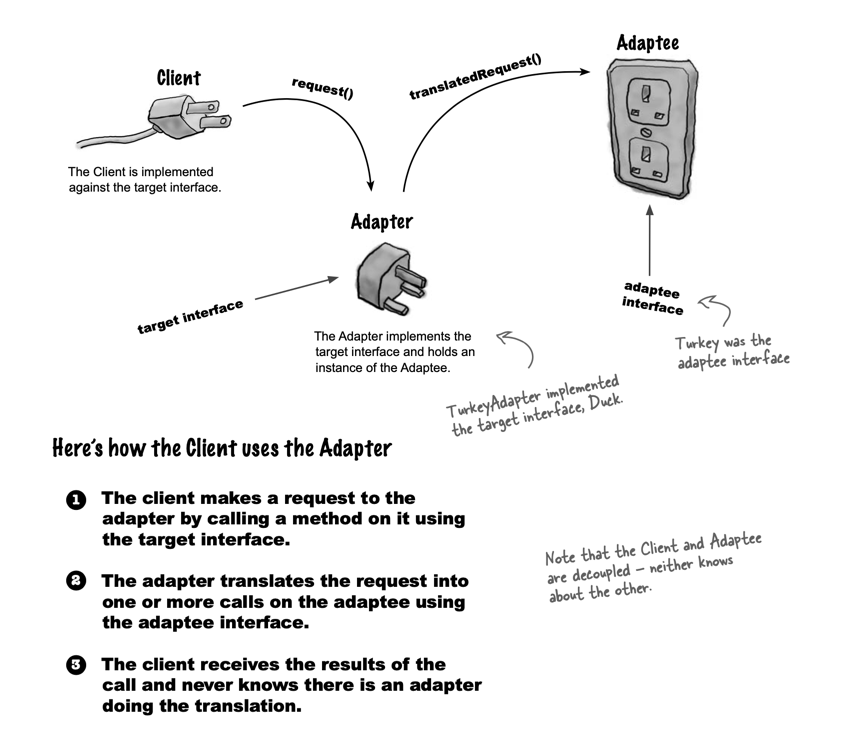

# Adaptor Pattern

> The Adapter Pattern converts the interface of a class into another interface the clients expect.
> Adapter lets classes work together that couldn’t otherwise because of incompatible interfaces.

# Facade Pattern

The intent of the Adapter Pattern is to alter an interface so that it matches one a client is expecting. The intent of
the Facade Pattern is to provide a simplified interface to a subsystem.

> The Facade Pattern provides a unified interface to a set of interfaces in a subsytem.
> Facade defines a higher- level interface that makes the subsystem easier to use.

## Principle of Least Knowledge - talk only to your immediate friends

It means when you are designing a system, for any object, **be careful of the number of classes it interacts 
with** and also how it comes to interact with those classes.