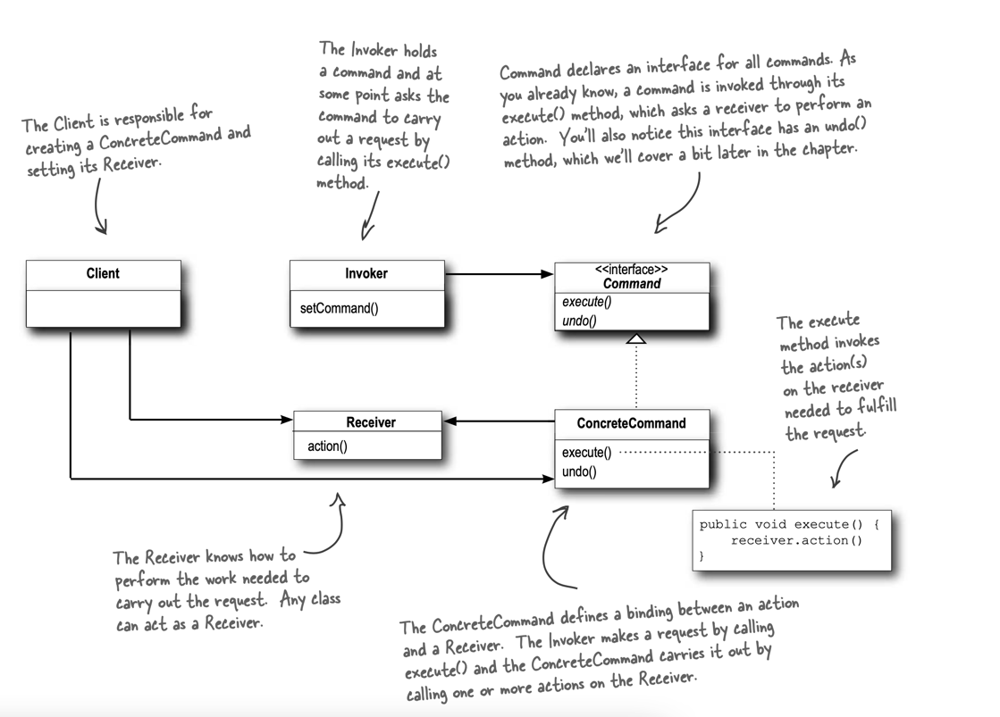

# Command Pattern

>The Command Pattern encapsulates a request as an object, thereby letting you parameterize other 
> objects with different requests, queue or log requests, and support undoable operations.

A command object encapsulates a request by binding together a set of actions on a specific receiver. 
To achieve this, it packages the actions and the receiver up into an object that exposes just one method, `execute()`.
When called, `execute()` causes the actions to be invoked on the receiver. 

From the outside, no other objects really know what actions get performed on what receiver; 
they just know that if they call the `execute()` method, their request will be serviced.

