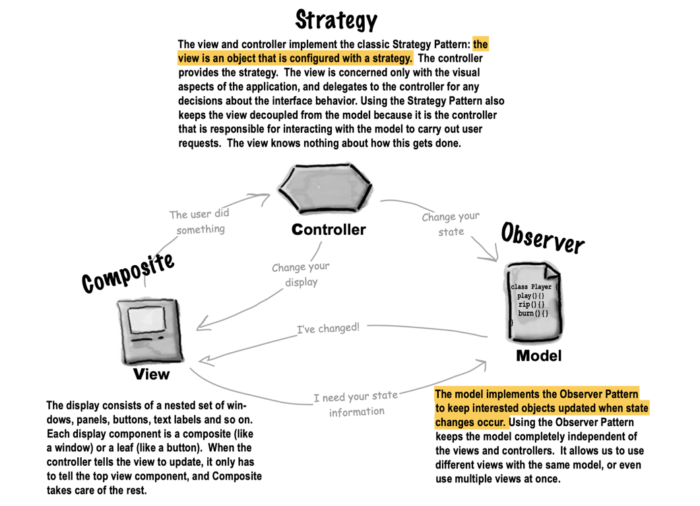

# Compound Pattern

- A goose came along and wanted to act like a Quackable too. So we used the Adapter Pattern to adapt the goose to a Quackable.
Now, you can call quack() on a goose wrapped in the adapter and it will honk!

- Then, the Quackologists decided they wanted to count quacks. So we used the Decorator Pattern 
to add a QuackCounter decorator that keeps track of the number of times quack() is called, 
and then delegates the quack to the Quackable it’s wrapping.

- But the Quackologists were worried they’d forget to add the QuackCounter decorator. 
So we used the Abstract Factory Pattern to create ducks for them. Now, 
whenever they want a duck, they ask the factory for one, and it hands back a decorated duck. 
(And don’t forget, they can also use another duck factory if they want an un-decorated duck!)

- We had management problems keeping track of all those ducks and geese and quackables. 
So we used the Composite Pattern to group quackables into Flocks. 
The pattern also allows the quackologist to create sub-Flocks to manage duck families.
We used the Iterator Pattern in our implementation by using java.util’s iterator in ArrayList.

- The Quackologists also wanted to be notified when any quackable quacked. 
So we used the Observer Pattern to let the Quackologists register as Quackable Observers. 
Now they’re notified every time any Quackable quacks. 
We used iterator again in this implementation. 
The Quackologists can even use the Observer Pattern with their composites.

## Class Diagram

## Model View Controller

## Bullet Points

- The Model View Controller Pattern (MVC) is a compound pattern **consisting of the Observer, 
Strategy and Composite patterns.**
- **The model makes use of the Observer Pattern** so that it can keep observers updated yet stay decoupled from them.
- **The controller is the strategy for the view.** The view can use different implementations of the 
controller to get different behavior.
- The view uses the **Composite Pattern** to implement the user interface, 
which usually consists of nested components like panels, frames and buttons.