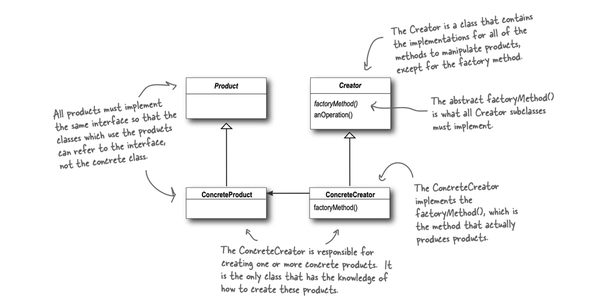
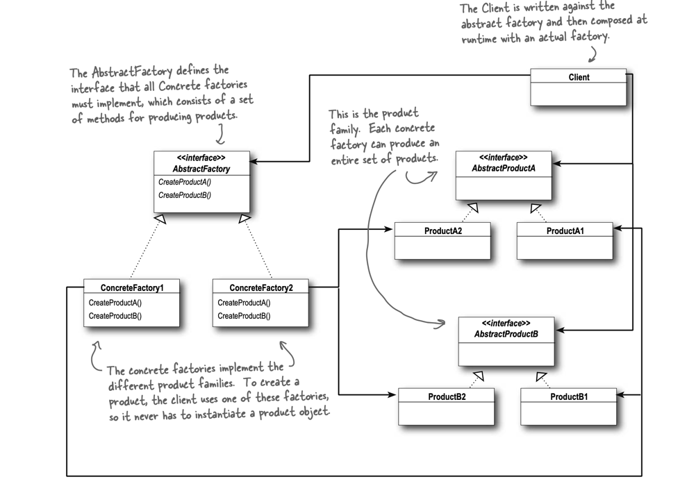

# Factory Pattern

>  The Factory Method Pattern defines an interface for creating an object,
> but lets subclasses decide which class to instantiate. 
> Factory Method lets a class defer instantiation to subclasses.

A factory method handles object creation and encapsulates it in a subclass.
This decouples the client code in the superclass from the object creation code in the subclass.

The intent of Factory Method is to allow a class to defer instantiation to its subclasses.

## Strive for loosely coupled designs between objects that interact

__Dependency Inversion Principle__
> Depend upon abstractions. Do not depend upon concrete classes.

It suggests that our `high-level` components should not depend on our `low-level` components; 
rather, they should both depend on abstractions.

# Abstract Factory Pattern

> The Abstract Factory Pattern provides an interface for creating families of related or dependent objects without specifying their concrete classes

