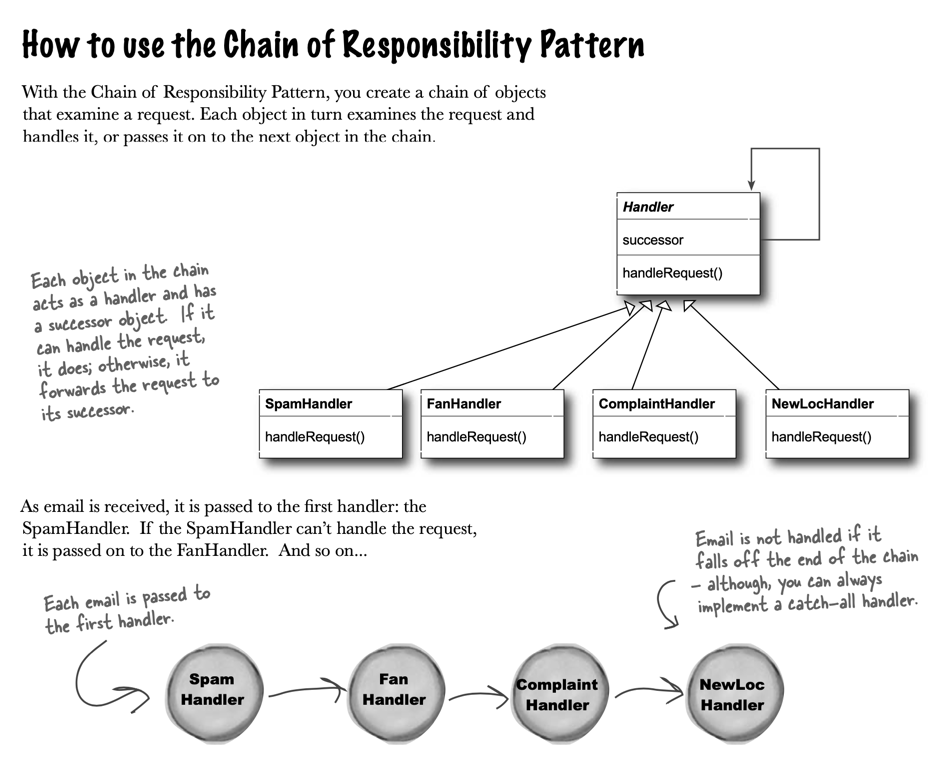
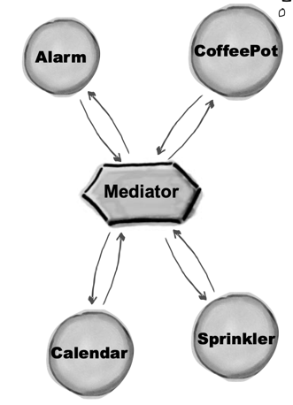

# Builder Pattern

> Use the Builder Pattern to encapsulate the construction of a product and allow it to be constructed in steps.

# Chain of Responsibility Pattern

> Use the Chain of Responsibility Pattern when you want to give more than one object a chance to handle a request.

## Mediator Pattern

> Use the Mediator Pattern to centralize complex communications and control between related objects

The Mediator contains all of the control logic for the entire system.