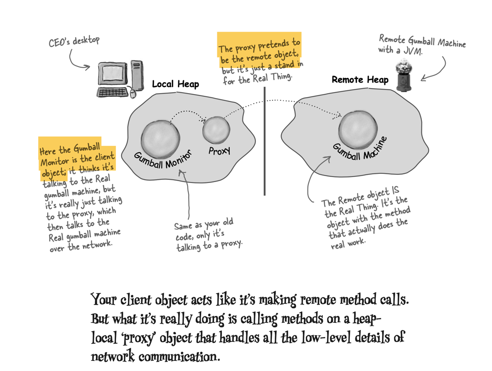
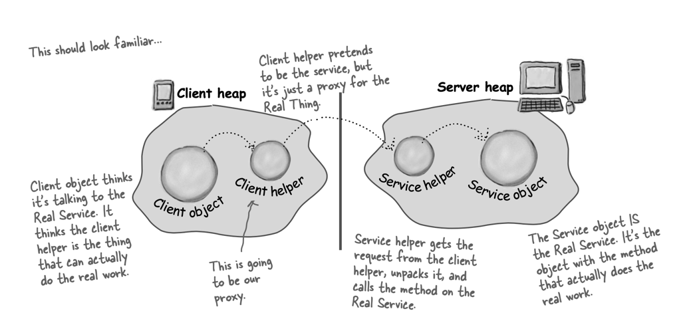
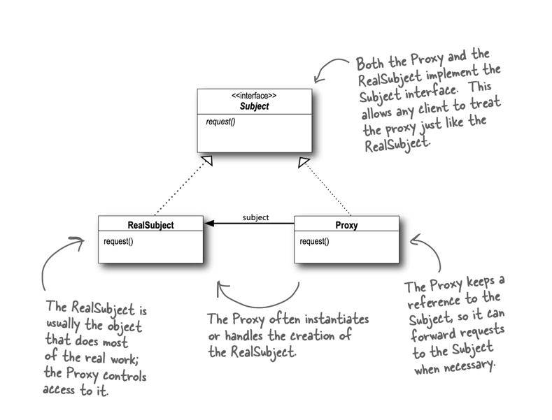

# The Proxy Pattern
The Proxy Pattern provides a representative for another object in order to control the client’s access to it. 
There are a number of ways it can manage that access.
>  The Proxy Pattern provides a surrogate or placeholder for another object to control access to it.

## Remote Method

Use the Proxy Pattern to create a representative object that controls access to another object, 
which may be remote, expensive to create or in need of securing.

First we have a Subject, which provides an interface for the RealSubject and the Proxy. 
**By implementing the same interface**, the Proxy can be substituted for the RealSubject anywhere it occurs.

The RealSubject is the object that does the real work. 
It’s the object that the Proxy represents and controls access to.

**The Proxy holds a reference to the RealSubject.** In some cases, 
the Proxy may be responsible for creating and destroying the RealSubject. 
Clients interact with the RealSubject through the Proxy.

The Proxy also controls access to the RealSubject; this control may be needed if 
1. the Subject is running on a remote machine
2. if the Subject is expensive to create in some way
3. if access to the subject needs to be protected in some way.

## Remote Proxy

With Remote Proxy, the proxy acts as a local representative for an object that lives in a different JVM.

## Virtual Proxy
Virtual Proxy acts as a **representative for an object that may be expensive to create**. The Virtual Proxy often defers 
the creation of the object until it is needed; the Virtual Proxy also acts as a surrogate for the object before and while it
is being created. After that, the proxy delegates requests directly to the RealSubject.

## Protection Proxy 
A Protection Proxy controls access to the methods of an object based on the caller.