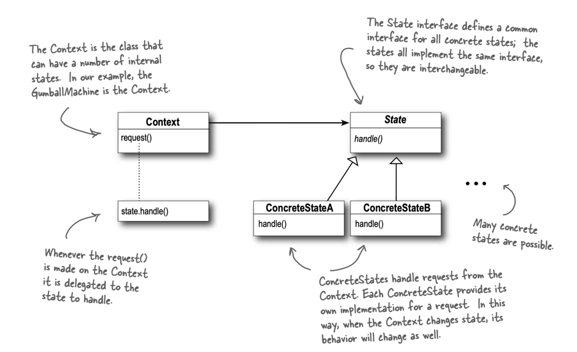

# The State Pattern

> The State Pattern allows an object to alter its behavior when its internal state changes. 
> The object will appear to change its class.

## State Pattern Diagram

The structure is similar to `Strategy Pattern`, where it uses composition to delegate functionalities. 
Except here the state transition is built 
into the scheme (context objects change state over time according to some well-defined state transitions.) 
