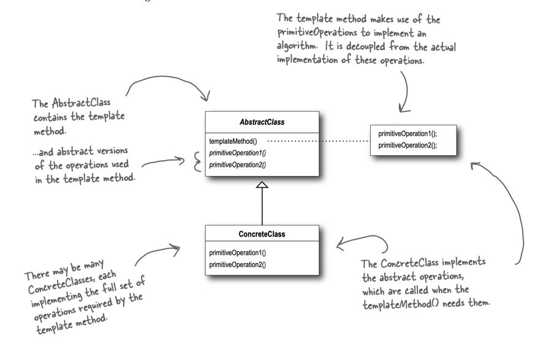

# Template Method Pattern

> The Template Method Pattern defines the skeleton of an algorithm in a method,
> deferring some steps to subclasses. Template Method lets subclasses redefine certain steps of
> an algorithm without changing the algorithm’s structure.



## The Hollywood Principle

```
Don’t call us, we’ll call you.
```

With the Hollywood Principle, we allow low-level components to hook themselves into a system, but the high-level
components determine when they are needed, and how. In other words, the high-level components give the low-level
components a “don’t call us, we’ll call you” treatment.
